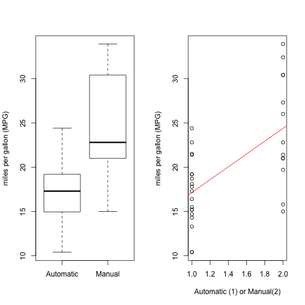

Developing Data Products Assignment week 4
========================================================
author: Alex Perez Nava
date: 10/July/2019
autosize: true

Developing Data Products 2019
========================================================
- URL: *https://www.coursera.org/learn/data-products/home/welcome*
- Find here all the data that have been use for this presentation."First, you will create a Shiny application and deploy it on Rstudio's servers. Second, you will use Slidify or Rstudio Presenter to prepare a reproducible pitch presentation about your application."
Look at the files here:

URL: *https://github.com/pereznavy/Shiny-Application-and-Reproducible-Pitch*

========================================================
## mtcars dataset

### Motor Trend Car Road Tests

> The data was extracted from the 1974 Motor Trend US magazine, and comprises fuel consumption and 10 aspects of automobile design and performance for 32 automobiles (1973–74 models).
### Source
> Henderson and Velleman (1981), Building multiple regression models interactively. Biometrics, 37, 391–411.


Look at data
========================================================


```r
library(datasets)
mpgData <- with(mtcars, data.frame(mpg, am))
mpgData$am <- factor(mpgData$am, labels = c("Automatic", "Manual"))
summary(mpgData)
```

```
      mpg                am    
 Min.   :10.40   Automatic:19  
 1st Qu.:15.43   Manual   :13  
 Median :19.20                 
 Mean   :20.09                 
 3rd Qu.:22.80                 
 Max.   :33.90                 
```

======================================================
## mtcars dataset - Format

**A data frame with 32 observations on 11 variables.**

| Index | Field | Detail |
------- | ----- | ------ |
| [, 1] | mpg | Miles/(US) gallon |
| [, 2]  | cyl | Number of cylinders |
| [, 3]	| disp | Displacement (cu.in.) |
| [, 4]	| hp | Gross horsepower |
| [, 5]	| drat | Rear axle ratio |
| [, 6]	| wt | Weight (lb/1000) |
| [, 7]	| qsec | 1/4 mile time |
| [, 8]	| vs | V/S |
| [, 9]	| am | Transmission (0 = automatic, 1 = manual) |
| [,10]	| gear | Number of forward gears |
| [,11]	| carb | Number of carburetors |

Fit Model
==================================

```r
fit <- lm(mpg ~ as.integer(am), data=mpgData)
summary(fit)
```

```

Call:
lm(formula = mpg ~ as.integer(am), data = mpgData)

Residuals:
    Min      1Q  Median      3Q     Max 
-9.3923 -3.0923 -0.2974  3.2439  9.5077 

Coefficients:
               Estimate Std. Error t value Pr(>|t|)    
(Intercept)       9.902      2.628   3.768 0.000720 ***
as.integer(am)    7.245      1.764   4.106 0.000285 ***
---
Signif. codes:  0 '***' 0.001 '**' 0.01 '*' 0.05 '.' 0.1 ' ' 1

Residual standard error: 4.902 on 30 degrees of freedom
Multiple R-squared:  0.3598,	Adjusted R-squared:  0.3385 
F-statistic: 16.86 on 1 and 30 DF,  p-value: 0.000285
```

Plot
========================================================


